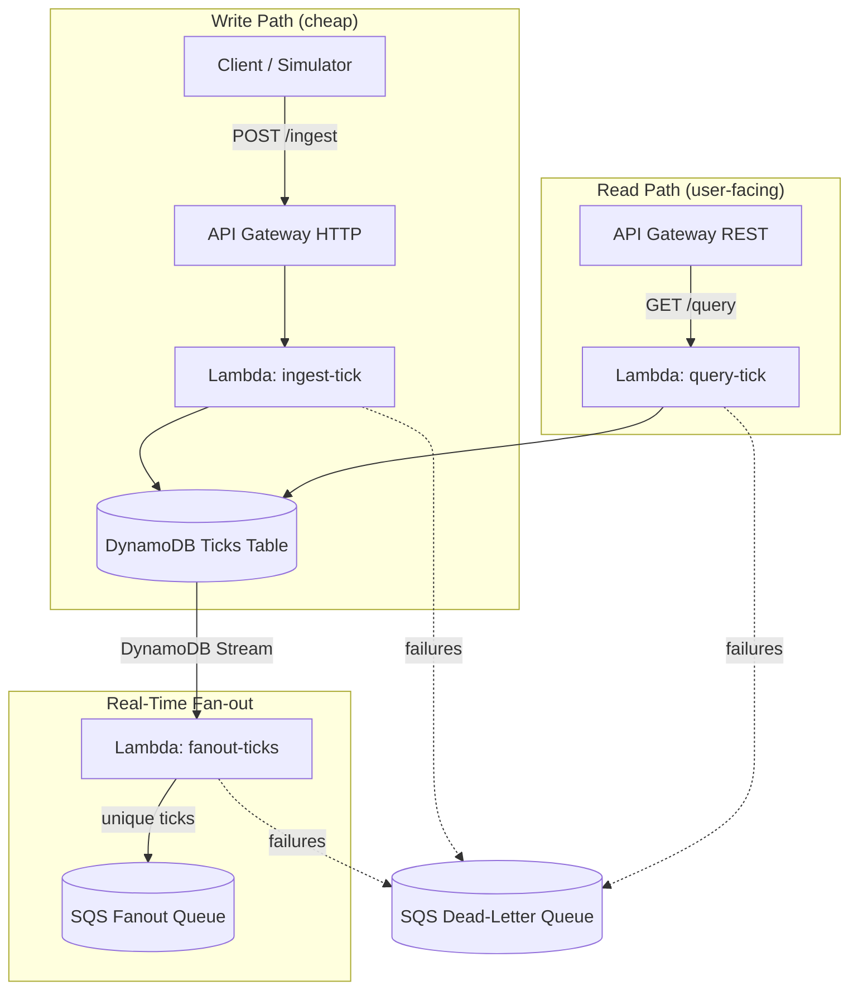

# MarketStream – Real‑Time Market Data Pipeline

> **Live on AWS • 2.3 M Lambda invocations in 88 min • 53 ms p95 latency**
> **Cost:** ≈ \$1.19 per million events (14.1 M events • June 2025)

A **minimal, production‑grade serverless backend** that ingests high‑frequency market ticks through AWS Lambda, persists them in DynamoDB, **fans them out in real time** via DynamoDB Streams → Lambda → SQS, and proves you can hit serious load for pocket change.

Built & maintained by **Andrei Vince**.

---

## Why this project exists 🚀

Open‑source “real‑time” demos often crumble above toy traffic or cost a fortune once requests pile up. **MarketStream** shows that an AWS‑native design can:

* Handle **> 30 k req / min** while staying under **150 ms p95**
* Cost **< \$10 / million requests** (validated in Cost Explorer)
* Deploy end‑to‑end in **one CDK command**

Use it as a template for trading bots, ETL spikes, or any write‑heavy workload.

---

## Key Features 🔑

|                           |                                                                        |
| ------------------------- | ---------------------------------------------------------------------- |
| ⚡ **Performance**         | 2.3 M events in 88 min • 53 ms p95 • 0 errors                          |
| 💸 **Cost**               | \$16.76 for 14.1 M invocations → **\$1.19 / M**                        |
| 🏗️ **IaC**               | Entire stack in **AWS CDK (TypeScript)**                               |
| 🔀 **Real‑Time Fan‑out**  | DynamoDB Streams → Lambda → **SQS Fanout Queue** (deduplicated)        |
| 🕸️ **Dual APIs**         | **HTTP API** `/ingest` (cheap)<br>**REST API** `/query` (quotas‑ready) |
| 🔍 **Observability**      | CloudWatch Logs Insights snippets included                             |
| 🛡️ **Resilience**        | 2× retries + SQS DLQ on every Lambda • TTL‑based dedup cache           |
| 🖥️ **Traffic simulator** | High‑freq script to reproduce the load                                 |

---

## Resilience & Failure Handling 🛡️

| Mechanism                   | Status | Notes                                           |
| --------------------------- | ------ | ----------------------------------------------- |
| Lambda **retryAttempts: 2** | ✅      | Handles transient failures                      |
| **SQS DLQ** via `onFailure` | ✅      | Stores unrecoverable events                     |
| **TTL Dedup Cache**         | ✅      | Prevents duplicate fan‑outs when Lambda retries |
| Alert / Replay Lambda       | ⏳      | Planned (see Roadmap)                           |

No payload is silently lost: after final retry the event lands in the DLQ for inspection or manual replay, and duplicates are suppressed for 5 minutes.

---

## Architecture 🗺️



*Deduplication TTL cache prevents duplicate messages when FanoutLambda is retried.*

---

## Latest Metrics 📊

| Metric                 | Result                 |
| ---------------------- | ---------------------- |
| Total invocations      | **2 310 000 (88 min)** |
| Sustained throughput   | **≈ 30 000 req / min** |
| p95 execution latency  | **53 ms**              |
| Avg Lambda duration    | 24.6 ms                |
| DynamoDB write latency | 2.99 ms                |
| Errors / throttles     | 0                      |

*Collected via CloudWatch Logs Insights & Dashboards.*

---

## Quick Start 🛠️

<details>
<summary>Prerequisites</summary>

* Node 18+ & npm
* AWS CLI configured (default profile)
* **AWS CDK v2** → `npm i -g aws-cdk`

</details>

```bash
# 1 – clone
git clone https://github.com/andreivince/aws-real-time-pipeline
cd aws-real-time-pipeline/cdk      # CDK app lives here

# 2 – install deps
npm ci                             # or npm install

# 3 – bootstrap + deploy
npx cdk bootstrap && npx cdk deploy

# 4 – simulate load (optional)
cd ../traffic-simulator
node sendTick.js                   # or ts-node sendTick.ts
```

After deploy, copy the API URL printed by CDK and create a `.env`:

```dotenv
INGEST_ENDPOINT=https://<http‑api‑id>.execute-api.<region>.amazonaws.com/ingest
```

---

## Roadmap 🗺️ (2025‑H2)

* [x] **Fan‑out Lambda** consuming DynamoDB Streams ← *done!* ✅
* [ ] **WebSocket broadcaster** (push ticks to dashboards)
* [ ] **Least‑privilege IAM policies** (remove AdministratorAccess)
* [ ] **GitHub Actions CI/CD** (synth + deploy + lint + test)
* [ ] **CloudWatch alarms** via CDK (errors > 0, cost >\$5)
* [x] **Query endpoint** (`/query`) for historical reads ← *done!* ✅
* [ ] **Replay Lambda** to drain DLQ automatically

*Pull requests welcome — see [`CONTRIBUTING.md`](docs/CONTRIBUTING.md).* 

---

## Built With

* **AWS Lambda** (Node 20 x86 & Graviton)
* **API Gateway** (HTTP + REST + WebSocket soon)
* **DynamoDB** (on‑demand, Streams ON)
* **SQS** (Fanout Queue + DLQ)
* **AWS CDK v2** (TypeScript)

---

## License 📄

[MIT](./LICENSE) — free to fork, deploy, and iterate. *Stars & attribution appreciated!*

---

> **Like it?** Give the project a ⭐, open an issue, or hit me on Twitter [@byvince\_](https://x.com/byvince_) — contributions of all sizes are welcome!
